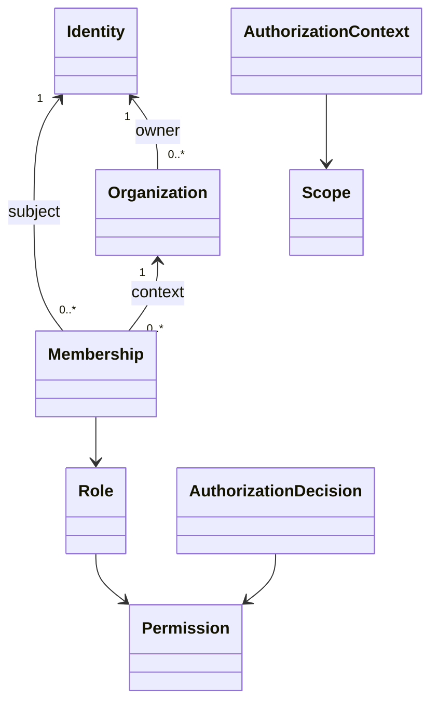

# Modelo de Domínio — Core Foundation
**Versão:** 1.0.0 | **Status:** refinamento aprovado para Sprint 1.1 | **Data:** 2026-07-20

Identity é raiz independente. Organization exige owner Identity ativa. Membership liga uma Identity ativa a uma Organization e contém role/scopes/status. Authorization avalia o snapshot contextual; não modifica agregados. Audit recebe fatos/decisões; Telemetry observa casos de uso.

Invariantes e lifecycle vêm das [Constituições do Kernel](../kernel/KERNEL_CONSTITUTION.md). **Riscos:** consistência entre repositories in-memory não é transação produtiva; concorrência permanece fora do escopo.
