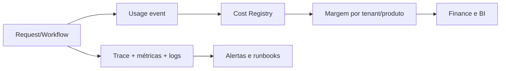

# Arquitetura de observabilidade

**Status:** Proposta
**Versão:** 1.0.0
**Data:** 2026-07-20

Logs estruturados, métricas e traces compartilham correlation ID, tenant anonimizado, produto, workflow e versão. PII/segredos são redigidos.

Indicadores: disponibilidade, erro, latência, saturação, fila, retries, custo de IA, tokens/unidades, uso por organização, conversão, receita, margem e churn. Auditoria de segurança é imutável e separada de debug.

Cada capability terá SLI/SLO, alertas acionáveis e runbook. Cost telemetry une usage event a rate versionada e revenue context.

Audit, Telemetry, Metrics, Tracing, Business Analytics, AI Costs, Security Events e Compliance são domínios distintos conforme a [Constituição de Observabilidade](../kernel/OBSERVABILITY_CONSTITUTION.md). Projeções podem compartilhar correlation, nunca ownership ou finalidade implicitamente.

