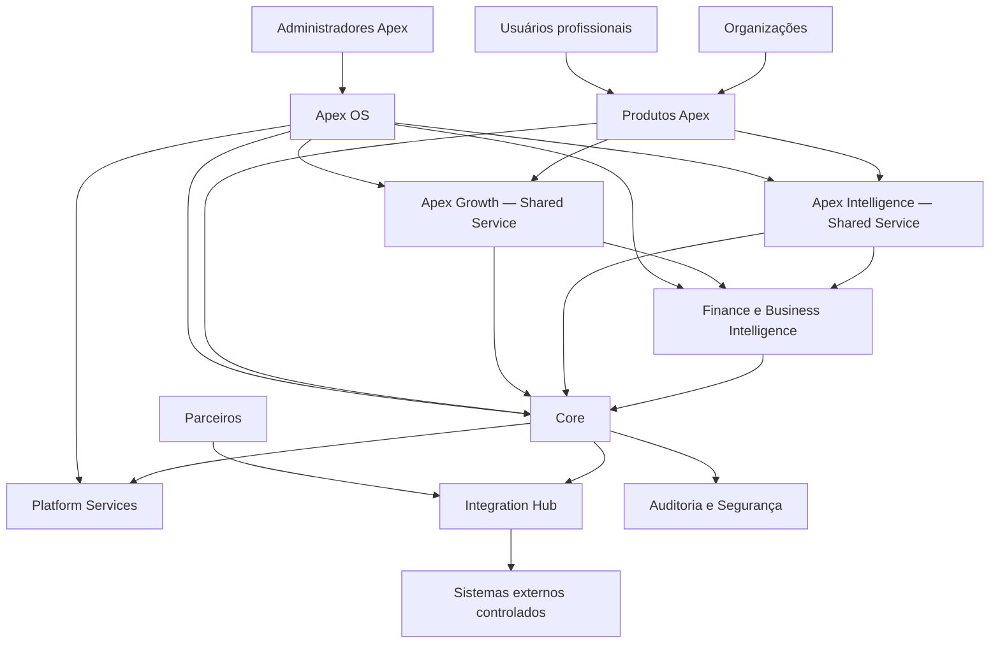

# Contexto do sistema

**Status:** Proposta C4 — nível de contexto
**Versão:** 1.0.0
**Data:** 2026-07-20

Atores: usuários profissionais, organizações clientes, administradores autorizados, equipe Apex, parceiros e auditores. Sistemas externos incluem identidade, pagamentos, IA, comunicação, storage, BIM/CAD e analytics, todos futuros e condicionais.

Estado atual: estrutura documental. Nenhum sistema acima foi implementado neste repositório.
