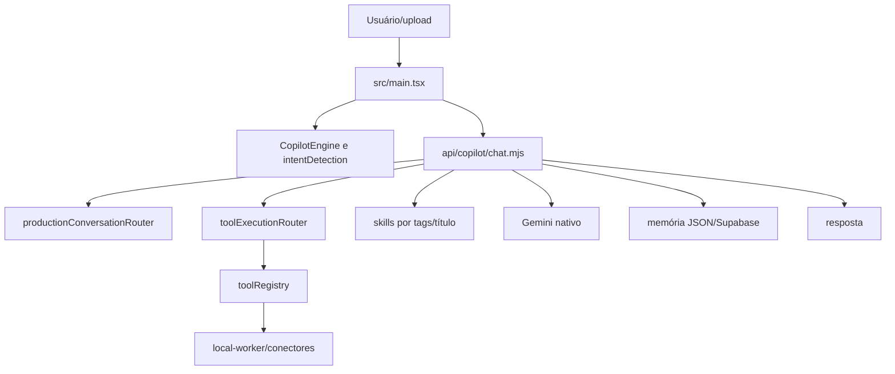

# 04 — Mapa real de orquestração

Fluxo comprovado: UI classifica; regexes selecionam módulos; backend aplica política/memória; routers classificam intenção/ferramenta; registry expõe configuração/mutação; provider responde.

Não existe registry empresarial ligando 2.087 itens a capability, custo, versão, owner e executor. Matching é lexical; frontend/backend têm detectores paralelos; memória é fragmentada.

api/copilot/chat.mjs contém timeouts de 12, 15 e 30 segundos, abaixo da regra interna de 60 segundos. Conflito de governança, confiança alta.