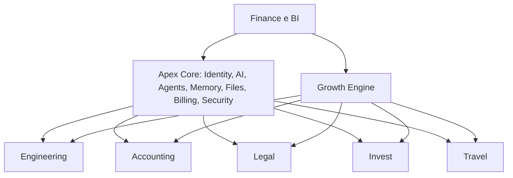

# 11 — Apex OS e arquitetura corporativa

| Modelo | Vantagem | Desvantagem | Veredito |
|---|---|---|---|
| Monólito | começo simples | acoplamento/blast radius | não |
| SaaS separados | autonomia | duplica Core | caro |
| Plataforma modular | reuso | superplataforma | bom para Core |
| Híbrido | Core + produtos vendáveis | exige contratos | recomendado |

Core possui tenant, policy, metering, providers, registry e arquivos. Produtos possuem regras/dados/workflows. Shared: OCR, documentos, busca, notifications, agenda, generation e analytics. Marketplace publica capabilities versionadas.

Dados contábeis/jurídicos não devem compartilhar tabelas/contexto indiscriminadamente. Qualidade: provider premium onde erro reduz confiança/receita. Custo: local onde SLO medido permite. Híbrido: roteamento por risco/complexidade.

Conclusão: Apex OS como plataforma interna; produtos vendáveis/implantáveis separadamente sobre contratos do Core. Confiança alta como direção, média até validar requisitos por domínio.