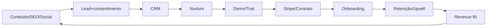

# 12 — Growth Engine e Revenue Architecture

Objetivo: maximizar receita sustentável e margem sem degradar qualidade.

Growth compartilhado: landing pages, SEO/blog, social, e-mail, WhatsApp, CRM, campanhas, conteúdo, criativos, DirectCut, scheduling, analytics, attribution, lead scoring e nurture. Cada produto mantém ICP, consentimento e mensagem.

Medir por produto/canal: CAC fully loaded, COGS, margem bruta/contribuição, ARPA, churn, LTV, payback, conversão e expansão. Não há telemetria para valores reais hoje; não inventar KPIs.

Engineering vende Copilot/Budget/RDO/BIM e expande ArchVis/compliance; Accounting vende portal/automação e expande fiscal/BI; Legal vende contratos e expande compliance; Invest vende intelligence; Travel vende planning; Marketing pode ser internal platform, managed service, API e white-label.

Guardrails: todo uso com tenant/product/workflow/provider/model/units/cost/revenue_context/idempotency; hard limits; budget; feature flags de margem; cache isolado; preços versionados.

Roadmap: P0 usage/cost/revenue + ICP âncora; P1 consolidar CRM/funil e planos; P2 cross-sell consentido e marketplace/API.

Conclusão: Growth é capability compartilhada do Apex OS; Finance/BI fecha aquisição→uso→custo→retenção→lucro.