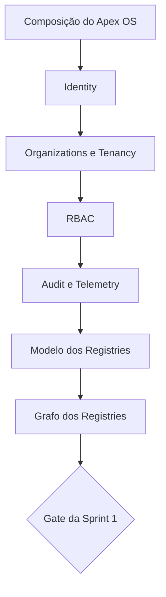

# Análise de lacunas de ADR

**Versão:** 1.0.0
**Status:** proposta de fila decisória; nenhuma decisão tomada
**Data:** 2026-07-20

## ADRs existentes

| ADR | Cobertura | Avaliação |
|---|---|---|
| 0001 | repositório limpo | suficiente para Foundation |
| 0002 | Core compartilhado | direção correta; composição ainda ampla |
| 0003 | migração controlada | coerente com políticas de migração |
| 0004 | independência de produtos | direção correta; faltam contratos de produto |
| 0005 | Growth compartilhado | conflita com Growth listado como produto |
| 0006 | custo e receita | direção correta; fronteiras financeiras ausentes |
| 0007 | governança única | decisão clara; skill precisa alinhar uma frase residual |

## Lacunas bloqueadoras antes da Sprint 1

| Prioridade | ADR recomendado | Questão que deve decidir | Motivo |
|---:|---|---|---|
| 1 | Composição e fronteiras do Apex OS | Apex OS inclui Core e Shared Services? | Remove ambiguidade estrutural central |
| 2 | Modelo de Identity e identidade humana/máquina | Quais identidades, sessões, federação e limites existem? | Identity é o primeiro módulo da Sprint 1 |
| 3 | Organizations e Tenancy | Relação entre organização, tenant, workspace, usuário e produto | Define isolamento e autoridade de dados |
| 4 | Autorização e RBAC | Escopos, roles, policies, deny/allow, delegação e avaliação | Permissions não pode nascer apenas de lista de requisitos |
| 5 | Audit versus Telemetry | Finalidade, retenção, imutabilidade, PII e acesso | Evita usar logs operacionais como evidência de auditoria |
| 6 | Modelo comum dos Registries | Identidade, versão, lifecycle, owner, contratos e relações | Necessário para Agent, Capability e Tool Registries |
| 7 | Grafo e ordem dos Registries | Tool/Capability precedem Agent ou aceitam referências pendentes? | A ordem proposta conflita com `CORE_MODULES.md` |

## Lacunas necessárias ainda na fundação

| ADR recomendado | Questão que deve decidir | Severidade |
|---|---|---|
| Growth: serviço, produto ou dois bounded contexts | Resolver classificação e monetização sem misturar CRM compartilhado com oferta comercial | Alta |
| Fronteiras de Billing, Entitlements, Cost e Finance & BI | Separar cobrança, direitos, rates, usage, contabilidade e análise | Média |
| Knowledge, Memory e Apex Intelligence | Separar autoridade de dados, retrieval, memória autorizada e processamento de IA | Média |
| Workflow ownership e execução | Distinguir engine, definições verticais, agentes e jobs | Média |
| Notifications e Communications | Separar consentimento/preferência, intenção e transporte | Média |
| Contratos de API, eventos e idempotência | Definir critérios de escolha e compatibilidade sem selecionar stack | Média |
| Product Registry e ciclo de vida de produtos | Definir catálogo, estados, ownership e relação com entitlements | Média |
| Classificação e retenção de dados | Formalizar classes, residência, exclusão, backup e legal hold | Média |
| Política de nomenclatura | Fixar português/inglês em conceitos e identificadores | Baixa |

## Ordem recomendada de decisão

## Critério para criar ADR

Criar o ADR somente quando houver contexto, alternativas reais, impactos de segurança/custo/operação, consequências, riscos e critérios de revisão. Esta análise recomenda decisões; não as toma.
