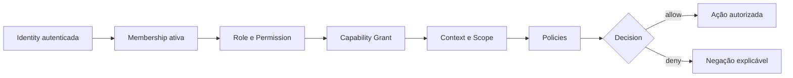

# Validação do Modelo de Autorização
**Versão:** 1.0.0 | **Status:** aprovado conceitualmente | **Data:** 2026-07-20

## Modelo decisório

Capability Grant só é exigido quando a ação invoca capability; demais ações ainda passam por permission/policy/scope. Entitlement pode ser requisito comercial anterior à decisão, nunca substitui segurança.

## Cenário BIM

Subject pode executar uma capability BIM apenas se autenticado, membro da Organization A, com permission e grant ativos, dentro do Tenant A1, Workspace X, Produto Engineering e Project Y, sob políticas de risco/custo. Qualquer explicit deny ou scope divergente nega.

## Casos negativos

- Administrator de outra Organization: deny.
- Agent usando permission do usuário sem delegação/grant: deny.
- Plano comercial ativo sem permission: deny.
- Permission ampla com Project fora do scope: deny.
- Tool operacional sem capability grant exigido: deny.

## Propriedades

Deny by default; least privilege; separação de funções; grants expirados; decisão explicável; step-up/aprovação para risco; Audit para decisões sensíveis; Telemetry para latência/erros da avaliação.

Nenhum mecanismo, linguagem ou banco foi escolhido.
