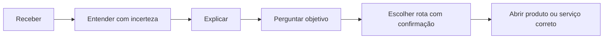

# Intelligent Intake Router
**Versão:** 1.0.0 | **Status:** modelo de experiência; não implementado | **Data:** 2026-07-20

## Entradas previstas

Imagem, PDF, IFC, RVT, DWG, contrato, vídeo, planilha e texto. Formatos adicionais exigem classificação e estratégia aprovada. Arquivos relacionados podem formar um pacote, preservando origem e relações.

## Fluxo oficial

O intake valida segurança, tipo real, tamanho, tenant, finalidade, consentimento e retenção antes de processamento. “Entender” pode significar apenas metadados quando não houver parser/viewer. A rota registra razões e contexto transferido.

Não implementa lógica vertical; Product/Integration/Capability Registries descrevem destinos futuros. Não executa automaticamente ações externas.

**Riscos:** malware, prompt injection documental, classificação errada, perda de contexto e custo não autorizado.
