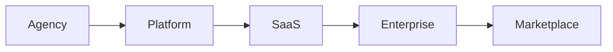

# Product Operating Model
**Versão:** 1.0.0 | **Status:** modelo empresarial oficial | **Data:** 2026-07-20

## Ciclo

- **Agency:** resolver problema real com entrega humana assistida e medir valor/custo.
- **Platform:** internalizar padrões repetíveis para operação própria, mantendo interfaces governadas.
- **SaaS:** oferecer workflow padronizado e autosserviço com suporte/economics controlados.
- **Enterprise:** adicionar escala, governança, integrações, compliance e contratos de serviço.
- **Marketplace:** permitir oferta/consumo de componentes e parceiros sob registries, billing e segurança.

## Gates

Cada transição exige problema repetido, demanda, qualidade, processo, dados permitidos, COGS/margem, segurança, suporte e capacidade de operação. Um produto pode permanecer em uma fase, saltar somente com evidência ou encerrar. Customização de Agency não entra automaticamente no Core.

## Relação com Produtos

O modelo é aplicado por Produto Vertical/oferta, não como migração única da empresa. Apex Growth apoia aquisição e lifecycle; Billing governa cobrança; Finance & BI mede economics.

**Riscos:** serviço artesanal permanente, automatizar processo ruim e marketplace sem liquidez.
